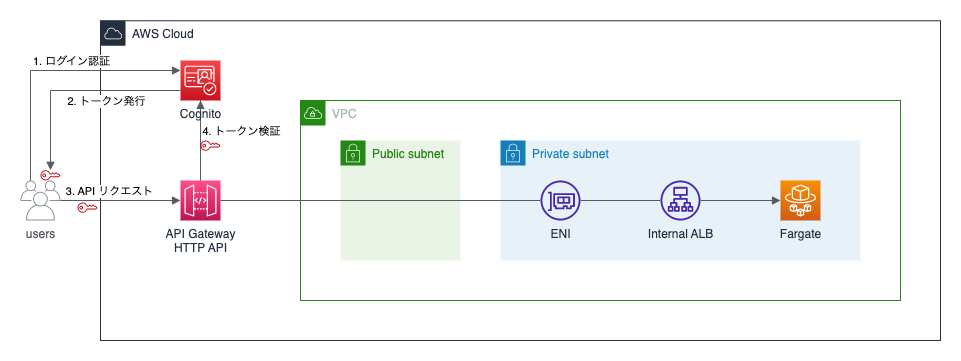

# next-cognito-example

Next.js で実装されたフロントエンドから AWS Fargate で実行されている API を実行する。認証基盤には Amazon Cognito を使っており、API リクエストには Amazon Cognito で発行された ID トークンを付与する。ID トークンの検証は Amazon API Gateway (HTTP API) の JWT オーサーライザーに任せている。



## デプロイ方法

### 1. Yarn の実行

依存している NPM モジュールをインストールするために Yarn を実行する。

```shell
$ yarn
```

### 2. バックエンドのデプロイ

バックエンドは AWS CDK でデプロイできる。

```shell
$ yarn workspace backend cdk deploy --context cognitoUserPoolDomainPrefix=<適当な文字列>
```

正常にデプロイが完了すると、下記のゆうに Outputs が表示される。

```
Outputs:
BackendStack.ApiLoadBalancerDNSXXXXXXXX = internal-xxxx.ap-northeast-1.elb.amazonaws.com
BackendStack.ApiServiceURLXXXXXXXX = http://internal-xxxx.ap-northeast-1.elb.amazonaws.com
BackendStack.CognitoClientId = xxxx
BackendStack.CognitoClientSecret = xxxx
BackendStack.CognitoIssuer = https://cognito-idp.ap-northeast-1.amazonaws.com/ap-northeast-1_xxxx
BackendStack.NextPublicBackendUrl = https://xxxx.execute-api.ap-northeast-1.amazonaws.com
```

### 3. `apps/frontend/.env.local` の作成

下記のような内容で `apps/frontend/.env.local` を作成する。

```
COGNITO_CLIENT_ID=<BackendStack.CognitoClientId の値>
COGNITO_CLIENT_SECRET=<BackendStack.CognitoClientSecret の値>
COGNITO_ISSUER=<BackendStack.CognitoIssuer の値>
NEXT_PUBLIC_BACKEND_URL=<BackendStack.NextPublicBackendUrl の値>
```

### 4. フロントエンドの実行

フロントエンドはローカル環境で実行する。

```
$ yarn workspace frontend dev
```

http://localhost:3000 にアクセスする。
